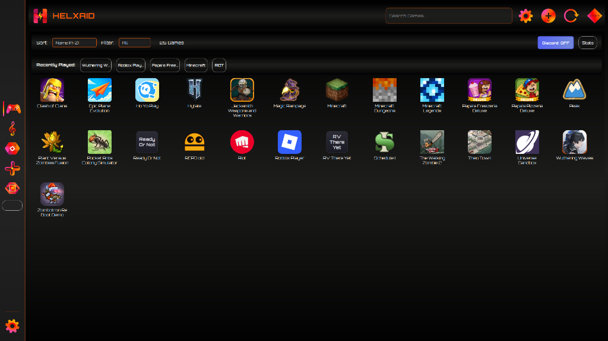
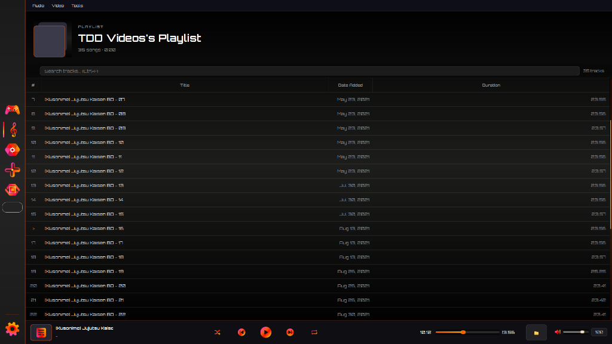
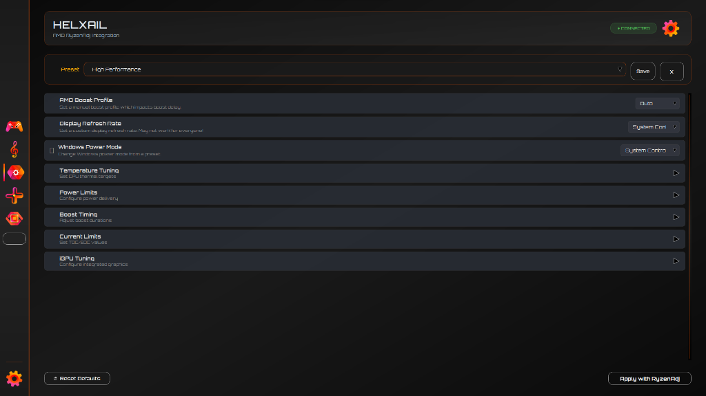
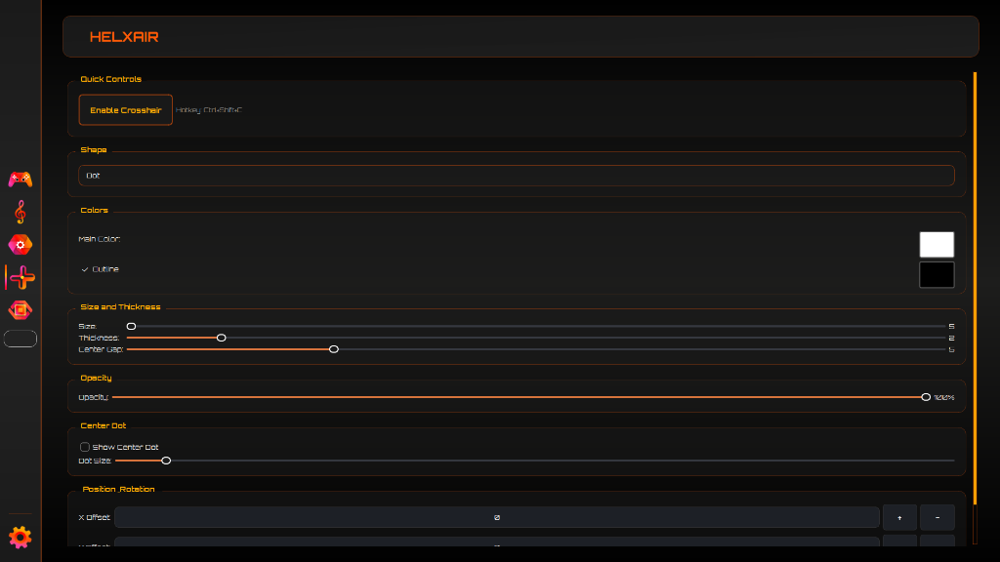
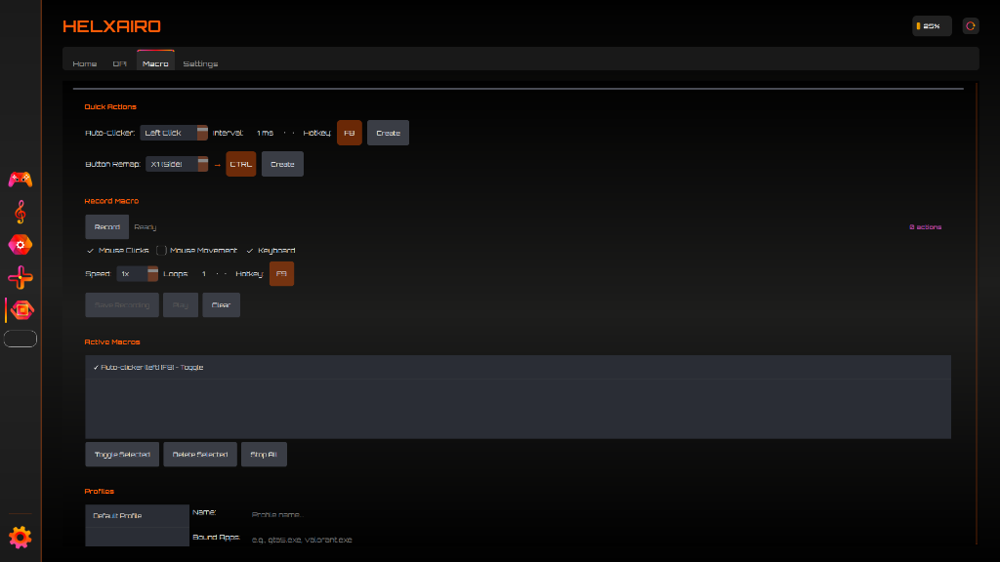
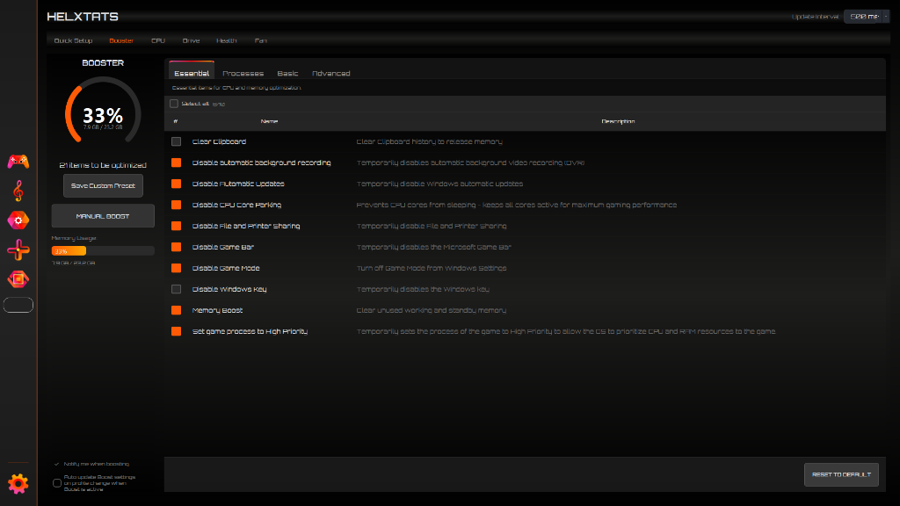

  

<h1 align="center">HELXAID :: Unified Gaming Command Center</h1>

  
  
  

  <b>A modular, high-performance desktop utility suite designed for gamers and power users.</b> 
  <i>Instead of running multiple scattered applications, HELXAID provides a centralized, hardware-accelerated control layer for launching games, tuning CPU performance, managing media, and automating inputs.</i>

---

## ✦ The Arsenal (Modules)

HELXAID is built entirely on a modular architecture. Each module serves a highly specific, uncompromising purpose, interacting with hardware at its core without bloated overhead.

<table align="center">
  <tr>
    <td width="50%" valign="top">
      <h3>1. HELXAID (Game Launcher)</h3>
      
The core hub. Automatically scans Steam, Google Play Games, and custom directories. Tracks playtime and fetches metadata automatically.

      <b>Status: ~95% Complete</b>
    </td>
    <td width="50%" align="center">
      
    </td>
  </tr>
  <tr>
    <td width="50%" align="center">
      
    </td>
    <td width="50%" valign="top">
      <h3>2. HELXAIC (Media Player)</h3>
      
Your integrated gaming soundtrack engine. Snappy, metadata-aware Spotify-like interface built to run MP3/MP4 files seamlessly in the background without draining resources.

      <b>Status: ~87% Complete</b>
    </td>
  </tr>
  <tr>
    <td width="50%" valign="top">
      <h3>3. HELXAIL (CPU Controller)</h3>
      
Hardware-level processor management. Natively interfaces with tools like RyzenAdj to tune power limits, display refresh rates, and boost timings directly from the GUI.

      <b>Status: ~90% Complete</b>
    </td>
    <td width="50%" align="center">
      
    </td>
  </tr>
  <tr>
    <td width="50%" align="center">
      
    </td>
    <td width="50%" valign="top">
      <h3>4. HELXAIR (Crosshair Overlay)</h3>
      
Custom on-screen crosshair overlay completely decoupled from game memory logic, ensuring 100% safety from aggressive anti-cheat systems.

      <b>Status: 100% Complete</b>
    </td>
  </tr>
  <tr>
    <td width="50%" valign="top">
      <h3>5. HELXAIRO (Hardware Macro)</h3>
      
Record, map, and execute hardware key sequences. Directly hooks into mouse/keyboard hardware via HID to assign rapid fire, DPI loops, and media controls.

      <b>Status: ~74% Complete</b>
    </td>
    <td width="50%" align="center">
      
    </td>
  </tr>
  <tr>
    <td width="50%" align="center">
      
    </td>
    <td width="50%" valign="top">
      <h3>6. HELXTATS (System Optimization)</h3>
      
A completely silent hardware optimizer. Clears standby memory, halts telemetry, and injects game processes with High Priority via native C++ hooks and VBS execution.

      <b>Status: ~50% Complete</b>
    </td>
  </tr>
</table>

---

## ✦ Portable Deployment & Updates

HELXAID is distributed as a **100% Portable Executable**. It leaves zero system registry footprints and runs completely standalone.

1. Download the latest `HELXAID.exe` from the [Releases Tab](../../releases).
2. Run `HELXAID.exe` natively from any directory.
3. The integrated OTA (Over-The-Air) updater will notify you of new updates by comparing local and server tags.
4. User configurations, game paths, and hardware presets are securely preserved inside `%APPDATA%\HELXAID`.

---

## ✦ Built For The Edge

HELXAID relies heavily on **Python (PySide6)** for the front-end logic and **C++** (via `pybind11`) for native Windows API hooking.

---

## ✦ Feature Notes

### 1. HELXAID (Game Launcher)
- Scan and manage Steam & Google Play Games libraries automatically
- Manage local custom game folders
- Track playtime and automatically fetch game icons and background metadata

### 2. HELXAIC (Media Player)
- Play local audio and video files (MP3, WAV, FLAC, MP4) as background music
- Modern, animated Spotify-style playlist interface with smooth column sorting
- Auto-extracts file metadata, playback duration, and album cover art
- Built-in volume, repeat/shuffle, and video background fit controls

### 3. HELXAIL (CPU Controller)
- CPU control via RyzenAdj
- Accessible only when required tools (RyzenAdj / UXTU) are available
- Debug handling when required dependencies are missing

### 4. HELXAIR (Crosshair Overlay)
- Customizable on-screen crosshair overlay (color, size, opacity)
- Works without hooking into game memory (safer for anti-cheats)

### 5. HELXAIRO (Hardware Macro)
- Map hardware keys to custom sequences and mouse inputs (integrated natively with C++)
- Control DPI, rapid fire, and basic multimedia actions

### 6. HELXTATS (System Optimization)
- Real-time Hardware stats (CPU, GPU, RAM) tracking
- Memory (RAM) cleaning optimization capabilities
- Silent background execution without disturbing active gameplay

---

## ✦ Changelog

### V4.11
- Sometimes CMD pop-up when launch at startup windows.
- Fixes "Start as minimized" setting functionality.
- Add "Hide Initialize Panel" setting functionality.
- Improve update detection.
- Add LHM Install panel if user didnt have (I forgot this one, sorry :( ).
- Add LHM at the list of uninstall tools.
- Add FFmpeg/FFprobe at the list of uninstall tools.

### v4.10.1
- Updated deployment instructions: `HELXAID` is now exclusively instructed to be downloaded natively as `.exe` file without needing zip extraction.
- Excluded `--onefile` build instructions from the workflow guide to significantly reduce Anti-Virus *False-Positives* (Windows Defender).

### v4.10
- Removed Save Custom Preset. Instead, everytime user check/uncheck the checkbox it will automatically saved.
- Disk SMART now shows physical drive health & temperature correctly instead of free space.
- Chart number clipping at the edge has been fixed.
- Fixed "Item to be optimized" count so it accurately syncs with checkbox states when opening the app.
- The text version in UI now accurately syncs with the current version.
- Hardware health is now correctly forced to launch required third-party apps like LibreHardwareMonitor first.
- Status Boosting now correctly syncs from the Booster tab to the Quick Setup Tab.

### v4.9
- **HELXTATS Boost Engine Rewrite:** fully silent native C++ execution using VBScript wrapper (no PowerShell popups, no annoying beeps)
- **YouTube Downloader Enhancements:** Added format (MP3/MP4) and specific Quality options (e.g. 320kbps, 1080p, etc.)
- Fixed FFmpeg local detection logic, ensuring reliable parsing inside Music Player
- Refined tray notification messaging and behaviors for Booster
- Support for auto-fetching required binaries (FFmpeg, RyzenAdj) to local AppData

---

## ✦ Development Status

HELXAID is under active development.  
Features, APIs, and internal structures may change as the project evolves.

This project prioritizes:
- Modular architecture
- Low system overhead
- Long-term maintainability
- Practical system control over visual gimmicks

---

## ✦ Tech Stack & Platform

- **Operating System:** Windows 10 / Windows 11
- **Core Application Engine:** Python (PySide6 / PyQt)
- **Native Hardware Layer:** C++ (with `pybind11` for direct Windows API & HID hooking)
- **Frontend / Modern UI Modules:** HTML5, CSS3, JavaScript (rendered natively via QtWebEngine)
- **System Automation Scripts:** PowerShell & VBScript (for silent execution & OS-level telemetry manipulation)
- **Build System:** CMake (Native Module) & PyInstaller (Release Packaging)

---

## ✦ Disclaimer & Warning

**Warning:** This suite controls low-level hardware parameters (like CPU Power Limits and Windows Services). Experimental by nature, designed for power users who know their hardware limits. Use at your own discretion.
