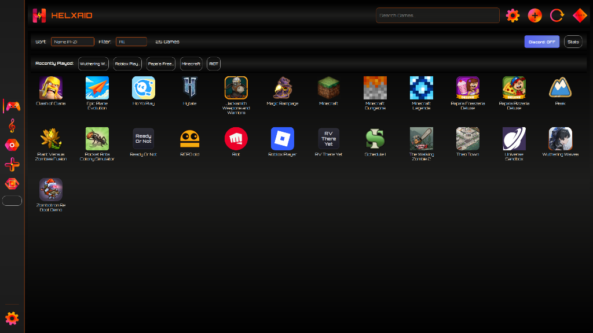
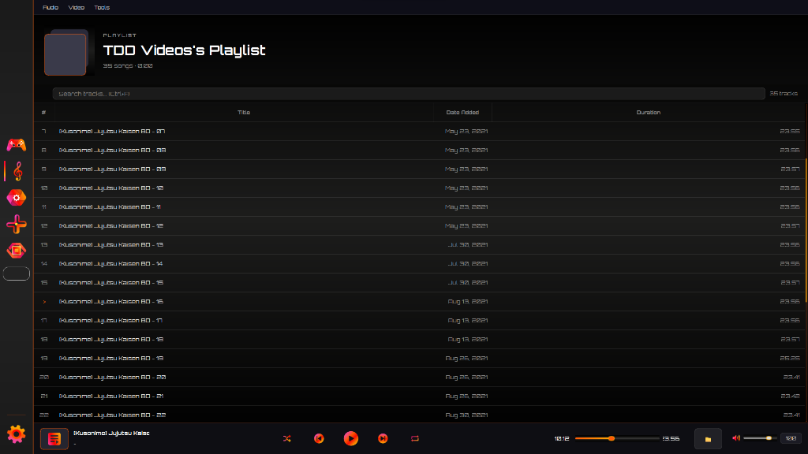
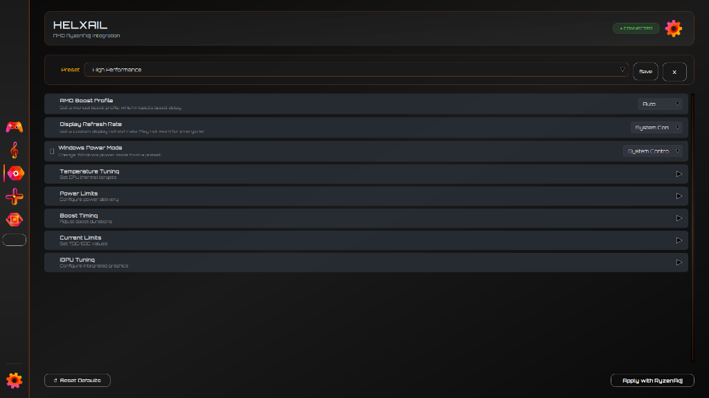
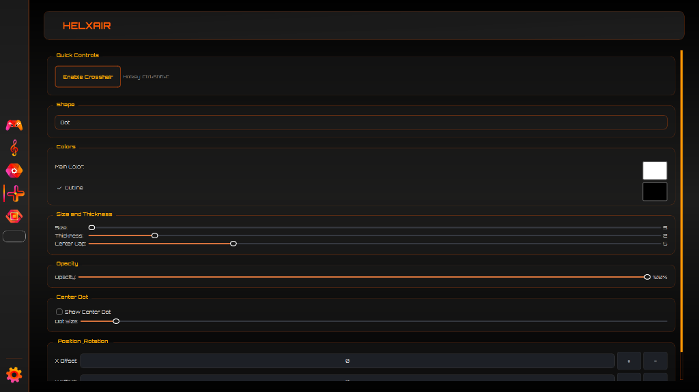
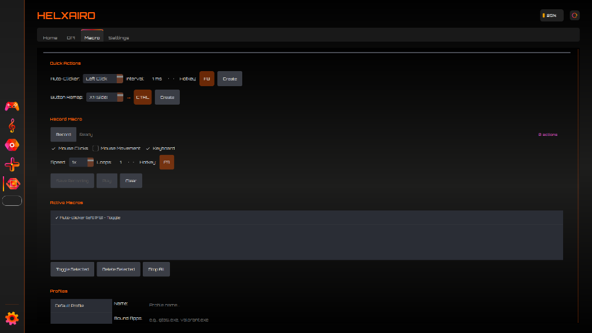
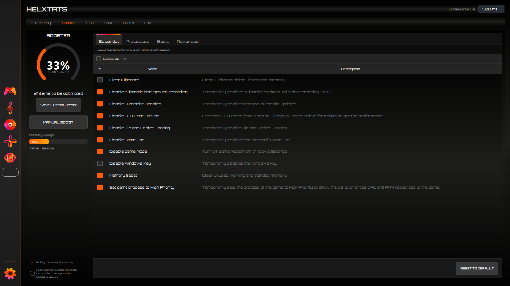

  

<h1 align="center">HELXAID : Unified Gaming Command Center</h1>

  
  
  

  <b>A modular, high-performance desktop utility suite designed for gamers and power users.</b> 
  <i>Engineered with a strict focus on modular architecture, minimal system overhead, and practical hardware control, providing a centralized, hardware-accelerated layer for game launching, CPU tuning, media management, and input automation.</i>

---

## ✦ The Arsenal (Modules)

HELXAID is built entirely on a modular architecture. Each module serves a highly specific, uncompromising purpose, interacting with hardware at its core without bloated overhead.

<table align="center">
  <tr>
    <td width="50%" valign="top">
      <h3>1. HELXAID (Game Launcher)</h3>
      
The core hub. Automatically scans Steam, Google Play Games, and custom directories. Tracks playtime and fetches metadata automatically.

    </td>
    <td width="50%" align="center">
      
    </td>
  </tr>
  <tr>
    <td width="50%" align="center">
      
    </td>
    <td width="50%" valign="top">
      <h3>2. HELXAIC (Media Player)</h3>
      
Your integrated gaming soundtrack engine. Snappy, metadata-aware Spotify-like interface built to run MP3/MP4 files seamlessly in the background without draining resources.

    </td>
  </tr>
  <tr>
    <td width="50%" valign="top">
      <h3>3. HELXAIL (CPU Controller)</h3>
      
Hardware-level processor management. Natively interfaces with tools like RyzenAdj to tune power limits, display refresh rates, and boost timings directly from the GUI.

    </td>
    <td width="50%" align="center">
      
    </td>
  </tr>
  <tr>
    <td width="50%" align="center">
      
    </td>
    <td width="50%" valign="top">
      <h3>4. HELXAIR (Crosshair Overlay)</h3>
      
Custom on-screen crosshair overlay completely decoupled from game memory logic, ensuring 100% safety from aggressive anti-cheat systems.

    </td>
  </tr>
  <tr>
    <td width="50%" valign="top">
      <h3>5. HELXAIRO (Hardware Macro)</h3>
      
Record, map, and execute hardware key sequences. Directly hooks into mouse/keyboard hardware via HID to assign rapid fire, DPI loops, and media controls.

    </td>
    <td width="50%" align="center">
      
    </td>
  </tr>
  <tr>
    <td width="50%" align="center">
      
    </td>
    <td width="50%" valign="top">
      <h3>6. HELXTATS (System Optimization)</h3>
      
A completely silent hardware optimizer. Clears standby memory, halts telemetry, and injects game processes with High Priority via native C++ hooks and VBS execution.

    </td>
  </tr>
</table>

---

## ✦ NEXT GENERATION : HELXAID V.5 (COMING SOON)

  
  
  

  <b>The next monumental chapter in the HELXAID ecosystem is currently being forged.</b> 
  <i>Engineered from the ground up for extreme gaming performance, zero-latency execution, and complete hardware dominance.</i>

<b>[DECRYPT CLASSIFIED DOSSIER // CLICK TO ACCESS LEAK]</b>

 

<table align="center" width="100%">
  <tr>
    <td align="left" style="background-color: #0d1117; padding: 20px; font-family: monospace;">
      <h3 align="center">[REDACTED] // CLASSIFIED CORE MODULE</h3>
      

        <code>CLEARANCE LEVEL: TOP SECRET // CLASSIFIED ACCESS ONLY</code>
      

      <pre>
[INIT] Loading HELXAID v5.0 Next-Gen Architecture...
[INFO] Native Low-Level Driver Bridge ................. [ACTIVE]
[INFO] Sub-millisecond Hardware Input Injection ....... [ENABLED]
[INFO] Project Codename: HELX[REDACTED]
[LEAK] Early Prototype Highlights:
  + Zero-RAM Idle Footprint Optimization Pipeline
  + Real-time Dynamic Frame Pacing and Kernel Governor
  + Unified Autonomous Hardware Orchestration
  + Direct Low-Level GPU Frame Buffer Integration
[WARN] Full telemetry specifications classified until Official v5.0 Launch.
      </pre>
      

        <b>✦ Module Identity:</b> <code>[CLASSIFIED // TO BE REVEALED IN V.5]</code> &nbsp;|&nbsp; <b>✦ Development Phase:</b> <i>Internal Alpha Prototype</i>
      

    </td>
  </tr>
</table>

---

## ✦ Portable Deployment & Updates

HELXAID is distributed as a **100% Portable Executable**. It leaves zero system registry footprints and runs completely standalone.

1. Download the latest `HELXAID.exe` from the [Releases Tab](../../releases).
2. Run `HELXAID.exe` natively from any directory.
3. The integrated OTA (Over-The-Air) updater will notify you of new updates by comparing local and server tags.
4. User configurations, game paths, and hardware presets are securely preserved inside `%APPDATA%\HELXAID`.

---

## ✦ Feature Notes

### 1. HELXAID (Game Launcher)

- Scan and manage Steam & Google Play Games libraries automatically
- Manage local custom game folders
- Track playtime and automatically fetch game icons and background metadata

### 2. HELXAIC (Media Player)

- Play local audio files (MP3, WAV, FLAC, OGG, M4A) as background music
- Modern, animated Spotify-style playlist interface with smooth column sorting
- Auto-extracts file metadata, playback duration, and album cover art
- Built-in volume, repeat/shuffle controls

### 3. HELXAIL (CPU Controller)

- CPU control via RyzenAdj
- Accessible only when required tools RyzenAdj are available
- Debug handling when required dependencies are missing

### 4. HELXAIR (Crosshair Overlay)

- Customizable on-screen crosshair overlay (color, size, opacity)
- Works without hooking into game memory (safer for anti-cheats)

### 5. HELXAIRO (Hardware Macro)

- Map hardware keys to custom sequences and mouse inputs (integrated natively with C++)
- Control DPI, rapid fire, and basic multimedia actions

### 6. HELXTATS (System Optimization, Hardware Stats, Network Stats)

- Real-time Hardware stats (CPU, RAM, Disk tracking; GPU requires LibreHardwareMonitor)
- Memory (RAM) cleaning optimization capabilities
- Network stats tracking (Bytes Sent, Bytes Received, Packets Sent, Packets Received, Errors, Collisions, Speed, Status, Type, Up Time)
- Silent background execution without disturbing active gameplay

---

## ✦ Changelog

For a detailed history of updates, feature additions, and bug fixes across all versions, please refer to [CHANGELOG.md](CHANGELOG.md) or visit the [Releases Tab](../../releases).

---

## ✦ Tech Stack & Platform

- **Operating System:** Windows 10 / Windows 11
- **Core Application Engine:** Python (PySide6)
- **Native Hardware Layer:** C++ (with `pybind11` for direct Windows API & HID hooking)
- **System Automation Scripts:** PowerShell & VBScript (for silent execution & OS-level telemetry manipulation)
- **Build System:** CMake (Native Module) & PyInstaller (Release Packaging)

---

## ✦ Disclaimer & Warning

**Warning:** This suite controls low-level hardware parameters (like CPU Power Limits and Windows Services). Experimental by nature, designed for power users who know their hardware limits. Use at your own discretion.
